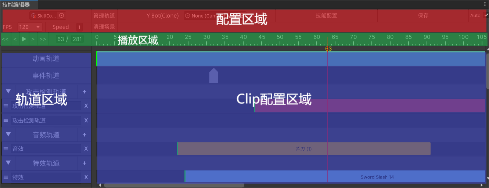

## 前言

由于我自己对编辑器的拓展和修改,有很多地方都是**不足**的,因为是我早期**学习**的作品,所以本编辑器推荐用于学习使用。

如果本人有精力,会出一套使用**IMGUI制作**的编辑器,大部分逻辑会套用此编辑器,但是会重构此编辑器的框架,因为现在的整体框架实现不太优雅了。

具体有轨道类与Clip类的**关联形式**,配置文件的**序列化**保存形式,没有没有对**运行时**做解耦。

如果想要了解本编辑器的**制作**,请自行学习此项目,这里着重讲解本**编辑器的使用**。

你了解本编辑器的使用了,那么有源码参考对于制作而言就没有什么问题了。

## 概览

**创建配置文件:** 需要右键`Creat-->Config-->SkillConfig`

**预览:**              拖动时间轴,可以预览整体的播放。

**添加Clip项:**   添加动画、音效、特效、只需要直接**拖拽对应资源**即可,事件、攻击检测需要右键添加。

**滚轮控制:**      对于绿色部分滚轮负责缩放,蓝色左边部分,滚轮负责上下移动,蓝色右边滚轮负责左右移动。



## 添加轨道

点击管理轨道来创建轨道,在选择轨道下拉框中,选择需要的轨道,点击添加。

可以看到面板上出现了对应的轨道。

## 技能播放

```csharp
public class Skill_Player : MonoBehaviour
```

需要使用Skill_Player类来播放技能。

## 动画播放

具体的动画播放其实是要你自己实现的。

实现以下接口的类,来播放动画,在本项目中,我使用了自定义的Playable,来播放动画。

本项目中使用的Playable有一个小问题,连续播放统计一个技能时,判断为同一个动画Key就return了。可以根据自己的需要修改一下。

```csharp
public interface ISkillAnimationPlayer
{
    public void PlayAnimation(string name, AnimationClip animationClip, float enterTIme);
    public void TrigerAnimationEvent(string eventName);
    public void ApplayRootMotion();
    public void PreventRootMotion();
}
```

具体如何实现`ISkillAnimationPlayer`可以参考:

```csharp
public class TestAnimationPlayer : MonoBehaviour,ISkillAnimationPlayer
```

## 配置数据

点击任意Clip项都可以在Inspectors中看到对于Clip的数据,然后进行修改。

但是以下内置轨道不同。

Clip项都内置有右键复制、移动、删除等功能。

## 配置动画轨道

动画轨道有右键RootMotion事件,可以用右键点击来配置RootMotion。

## 配置事件轨道

通过右键Project窗口来创建`Create-->AE技能编辑器-->事件列表`事件列表。

点击事件Clip项，选择事件列表，之后可以配置事件名称。

## 配置攻击检测轨道

直接对场景中对应的脚本更改攻击检测参数,并且对场景中的攻击检测对象进行移动、旋转、缩放。

对于攻击检测的时间可以拖动Clip的尾部进行增加和缩短,再右键点击对准位置即可。

## 特效轨道

配置方式与攻击检测轨道一致。

直接对场景中的攻击检测对象进行移动、旋转、缩放。

再右键点击对准位置即可。

## 注意事项

如果你要用于工程中请将Auto保存打开,否则容易丢失数据。

请勿删除轨道脚本文件否则所有配置作废。

本项目配置依赖于Oding序列化,因为本项目的配置是使用字典,并使用Oding序列化字典。

添加轨道需要修改运行时代码,因为轨道类的转化是用字符串写死在`Skill_Player`中的，需要在`Skill_Player`添加轨道类。